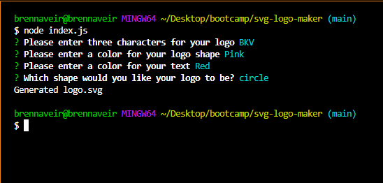

# SVG Logo Maker

## Table of Contents (

- [Description](#decription)
- [Usage](#usage)
- [Contributors](#contributors)
- [License](#License)
- [Questions](#questions)

## Description
A node.js command line application that takes in user input to generate a logo and save it as an .svg file

## Usage
This application is a command line application that can be initiated by typing node index.js into the command line

[

[

[

[Watch a video tutorial here!](https://drive.google.com/file/d/1ph4E9ubNs7hPF3ZjIEjEFwbf7b9f2paC/view)

## Contributors
Brenn Voyles

## License
[MIT License](https://spdx.org/licenses/MIT.html)

Permission is hereby granted, free of charge, to any person obtaining a copy
of this software and associated documentation files (the "Software"), to deal
in the Software without restriction, including without limitation the rights
to use, copy, modify, merge, publish, distribute, sublicense, and/or sell
copies of the Software, and to permit persons to whom the Software is
furnished to do so.

## Questions 
If there are any additional questions, feel free to reach out by email or github.

Email: [brennaveir@hotmail.com](mailto:brennaveir@hotmail.com)

Github: [brennaveir](https://github.com/brennaveir)

